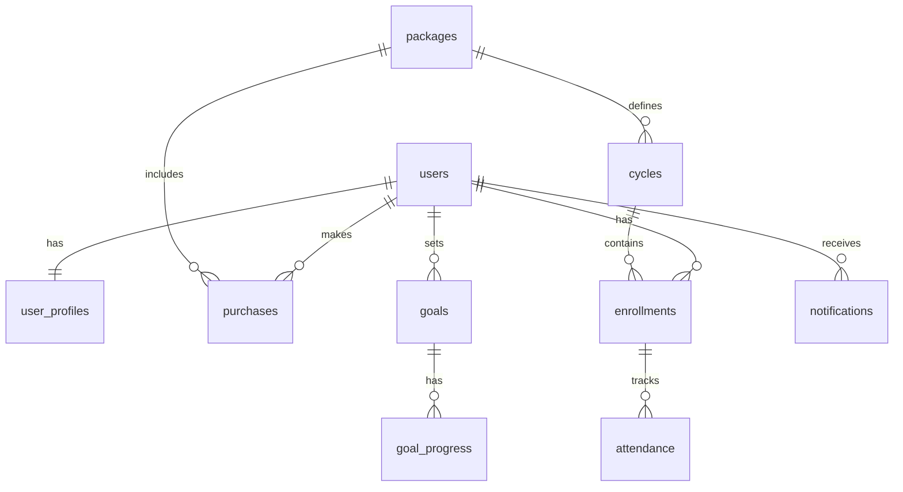

# Database Schema Design (3NF)

## Overview
This schema is designed in Third Normal Form (3NF) to support the HOME Experience platform, including the web administration dashboard and the future mobile application. It handles user management, package purchases, event scheduling, attendance tracking, and notification systems.

## Tables

### 1. User Management

#### `users`
Core user authentication and identity.
- `id` (UUID, PK)
- `email` (VARCHAR, Unique)
- `password_hash` (VARCHAR)
- `role` (ENUM: 'ADMIN', 'STUDENT', 'INSTRUCTOR')
- `created_at` (TIMESTAMP)
- `updated_at` (TIMESTAMP)
- `last_login` (TIMESTAMP)
- `is_active` (BOOLEAN)

#### `user_profiles`
Extended user details.
- `user_id` (UUID, FK -> users.id, PK)
- `first_name` (VARCHAR)
- `last_name` (VARCHAR)
- `phone` (VARCHAR)
- `date_of_birth` (DATE)
- `avatar_url` (VARCHAR)
- `bio` (TEXT)
- `emergency_contact_name` (VARCHAR)
- `emergency_contact_phone` (VARCHAR)

### 2. Packages & Commerce

#### `packages`
Available course packages.
- `id` (INT, PK)
- `name` (VARCHAR) - e.g., "INICIAL", "AVANZADO"
- `description` (TEXT)
- `price` (DECIMAL)
- `duration_days` (INT)
- `level_rank` (INT) - For prerequisite logic
- `is_active` (BOOLEAN)

#### `purchases`
Transaction records.
- `id` (UUID, PK)
- `user_id` (UUID, FK -> users.id)
- `package_id` (INT, FK -> packages.id)
- `amount` (DECIMAL)
- `currency` (VARCHAR)
- `status` (ENUM: 'PENDING', 'COMPLETED', 'REFUNDED')
- `transaction_id` (VARCHAR)
- `purchase_date` (TIMESTAMP)
- `payment_method` (VARCHAR)

### 3. Events & Scheduling

#### `cycles`
Scheduled course iterations.
- `id` (INT, PK)
- `package_id` (INT, FK -> packages.id)
- `start_date` (DATE)
- `end_date` (DATE)
- `capacity` (INT)
- `location` (VARCHAR)
- `status` (ENUM: 'SCHEDULED', 'IN_PROGRESS', 'COMPLETED', 'CANCELLED')
- `instructor_id` (UUID, FK -> users.id)

#### `enrollments`
Student registration in specific cycles.
- `id` (UUID, PK)
- `user_id` (UUID, FK -> users.id)
- `cycle_id` (INT, FK -> cycles.id)
- `purchase_id` (UUID, FK -> purchases.id)
- `status` (ENUM: 'ACTIVE', 'COMPLETED', 'DROPPED', 'CONFLICT')
- `enrollment_date` (TIMESTAMP)
- `pl_number` (INT) - Personal Leadership number

#### `attendance`
Daily attendance tracking.
- `id` (BIGINT, PK)
- `enrollment_id` (UUID, FK -> enrollments.id)
- `date` (DATE)
- `status` (ENUM: 'PRESENT', 'ABSENT', 'LATE', 'EXCUSED')
- `notes` (TEXT)

### 4. Mobile App Integration

#### `goals`
User-defined personal goals.
- `id` (UUID, PK)
- `user_id` (UUID, FK -> users.id)
- `title` (VARCHAR)
- `description` (TEXT)
- `category` (VARCHAR)
- `target_date` (DATE)
- `status` (ENUM: 'IN_PROGRESS', 'COMPLETED', 'ABANDONED')
- `created_at` (TIMESTAMP)

#### `goal_progress`
Tracking updates for goals.
- `id` (UUID, PK)
- `goal_id` (UUID, FK -> goals.id)
- `update_date` (TIMESTAMP)
- `value` (INT) - Percentage or metric value
- `notes` (TEXT)

#### `notifications`
System notifications.
- `id` (UUID, PK)
- `user_id` (UUID, FK -> users.id)
- `title` (VARCHAR)
- `body` (TEXT)
- `type` (ENUM: 'SYSTEM', 'REMINDER', 'ACHIEVEMENT', 'ANNOUNCEMENT')
- `is_read` (BOOLEAN)
- `created_at` (TIMESTAMP)
- `action_url` (VARCHAR)

#### `notification_preferences`
User settings for notifications.
- `user_id` (UUID, FK -> users.id, PK)
- `email_enabled` (BOOLEAN)
- `push_enabled` (BOOLEAN)
- `sms_enabled` (BOOLEAN)
- `reminder_frequency` (ENUM: 'DAILY', 'WEEKLY', 'NONE')

## Relationships Diagram

